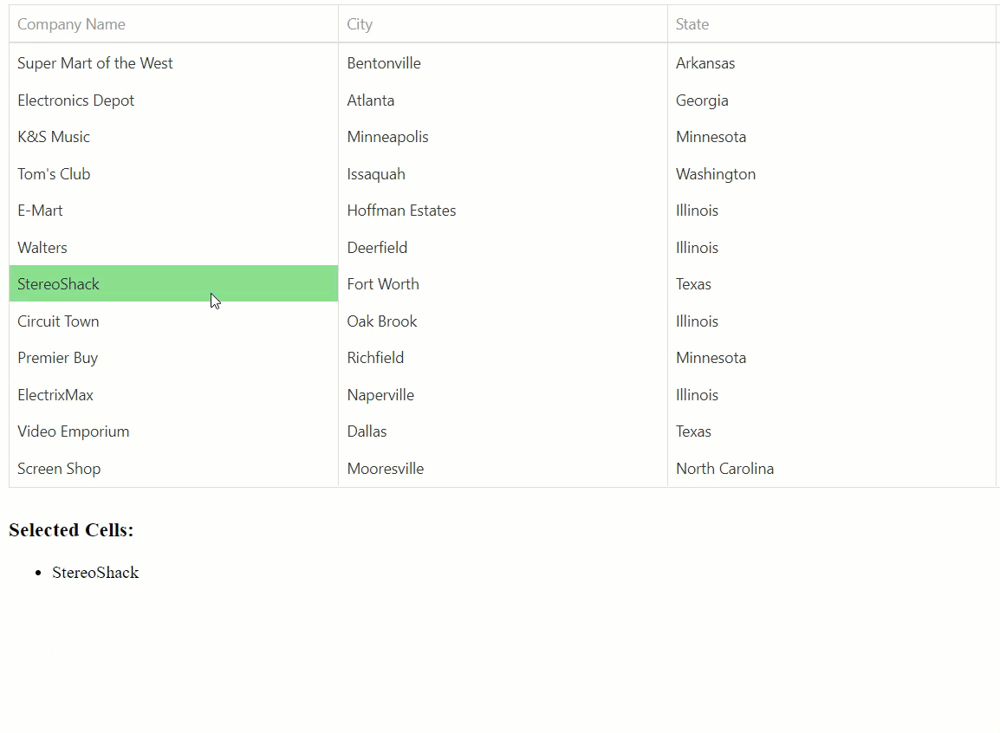

<!-- default badges list -->

<!-- default badges end -->
# DataGrid for DevExtreme - How to allow users select multiple cells

This example illustrates how to implement multiple cell selection for DataGrid.

Use the [onCellHoverChanged](https://js.devexpress.com/Documentation/ApiReference/UI_Components/dxDataGrid/Configuration/#onCellHoverChanged) and [onCellClick](https://js.devexpress.com/Documentation/ApiReference/UI_Components/dxDataGrid/Configuration/#onCellClick) event handlers to implement cell selection. The [cellValue](https://js.devexpress.com/Documentation/ApiReference/UI_Components/dxDataGrid/Methods/#cellValuerowIndex_visibleColumnIndex_value) method uses cells' `columnIndex` and `rowIndex` properties to display the corresponding cell values.

The `touchmove` and `touchstart` events are used to ensure this example also works on mobile devices.

## Files to Review

- **Angular**
    - [app.component.html](Angular/src/app/app.component.html)
    - [app.component.ts](Angular/src/app/app.component.ts)
- **jQuery**
    - [index.js](jQuery/index.js)
- **React**
    - [App.js](React/src/App.js)
- **Vue**
    - [App.vue](Vue/src/App.vue)
- **NetCore**
    - [Index.cshtml](ASP/ASPMultipleSelection/Views/Home/Index.cshtml)

## Documentation

- [Getting Started with DataGrid](https://js.devexpress.com/Documentation/Guide/UI_Components/DataGrid/Getting_Started_with_DataGrid/)

- [DataGrid - Selection](https://js.devexpress.com/Documentation/Guide/UI_Components/DataGrid/Selection/)

## More Examples

- [DataGrid for DevExtreme - How to obtain all filtered and sorted rows](https://github.com/DevExpress-Examples/devextreme-datagrid-get-all-filtered-data)

- [DataGrid for DevExtreme - How to implement a custom editing form using the Popup and Form components](https://github.com/DevExpress-Examples/devextreme-datagrid-custom-editing-form)
<!-- feedback -->
## Does this example address your development requirements/objectives?

 

(you will be redirected to DevExpress.com to submit your response)
<!-- feedback end -->
